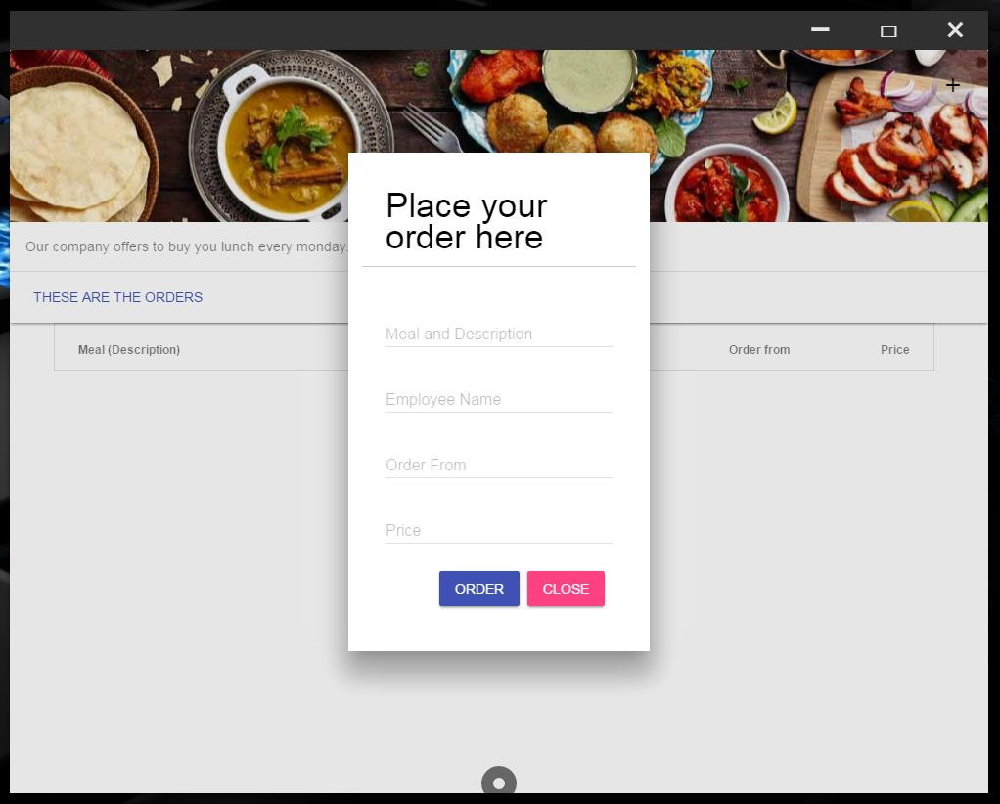
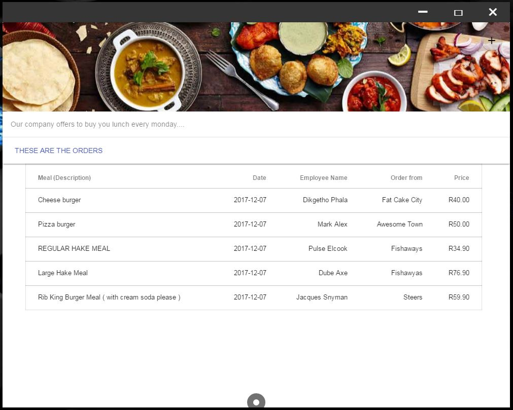

# ElectronDemoApp
A simple program that works like a to do app, for placing orders.

## Getting started 

Download the source code

### Prerequisites

Ensure that you have NodeJs installed - you can download it from the link

```
https://nodejs.org/en/download/
```

### Installing

Install electron globally

```
npm install electron -g
```
Open the directory where the source code is and run the below command

```
electron .
```
### How the app looks like


